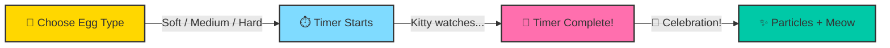

# egg-timer<div align="center">

<!-- Animated SVG Banner -->


<!-- Animated Typing SVG -->
<a href="https://github.com/1sarthak7/egg-timer">
  
</a>

<br/>

<!-- Shields / Badges Row 1 -->
[](https://www.python.org/)
[](https://pypi.org/project/PyQt6/)
[](LICENSE)
[](https://github.com/1sarthak7/egg-timer/stargazers)

<br/>

<!-- Shields / Badges Row 2 -->
[](https://github.com/1sarthak7/egg-timer/network/members)
[](https://github.com/1sarthak7/egg-timer/issues)
[](https://github.com/1sarthak7/egg-timer/commits)
[](https://github.com/1sarthak7/egg-timer)

<br/><br/>

<!-- Animated Divider -->


</div>

<br/>

##  &nbsp;About The Project

> 🐱 **Kitty Egg Timer** is a **premium animated desktop egg timer** featuring an adorable kitty mascot that keeps you company while your eggs cook to perfection. Built with **PyQt6**, it delivers buttery-smooth animations, celebration particles, and delightful sound effects — all wrapped in a sleek dark-mode interface.

<div align="center">

```
    /\_/\        ╔══════════════════════════════════╗
   ( o.o )  ───▶ ║   🥚  Your Egg Timer Companion  ║
    > ^ <        ║   ⏱  Precise Countdown Ring      ║
   /|   |\       ║   ✨  Particle Celebrations       ║
  (_|   |_)      ║   🔔  Sound Effects & Meows      ║
                 ╚══════════════════════════════════╝
```

</div>

<br/>

<div align="center">

</div>

<br/>

##  &nbsp;Features

<div align="center">

<table>
<tr>
<td align="center" width="250">

### 🐱 Kitty Mascot


Adorable animated cat companion that **bobs**, **blinks**, and **jumps** when your timer completes!

</td>
<td align="center" width="250">

### ⏱️ Timer Ring


Smooth circular countdown with **gradient progress**, **glow effects**, and **shake animations**

</td>
<td align="center" width="250">

### ✨ Particles


Beautiful **celebration particles** burst across the screen when your egg is done!

</td>
</tr>
<tr>
<td align="center" width="250">

### 🎨 Dark Theme


Sleek **glassmorphism** dark UI with subtle gradients and **premium styling**

</td>
<td align="center" width="250">

### 🔔 Sound FX


Tick-tock countdown sounds, **bell chimes**, and an adorable **meow** on completion!

</td>
<td align="center" width="250">

### 🥚 Egg Presets


One-tap presets for **Soft (5m)**, **Medium (7m)**, and **Hard (10m)** boiled eggs

</td>
</tr>
</table>

</div>

<br/>

<div align="center">

</div>

<br/>

##  &nbsp;Tech Stack

<div align="center">

<a href="https://www.python.org/"></a>
&nbsp;&nbsp;&nbsp;
<a href="https://www.qt.io/"></a>
&nbsp;&nbsp;&nbsp;
<a href="https://git-scm.com/"></a>
&nbsp;&nbsp;&nbsp;
<a href="https://github.com/"></a>

<br/><br/>

| Technology | Purpose |
|:---:|:---|
|  | Core language |
|  | GUI framework with hardware-accelerated rendering |
|  | Settings persistence |

</div>

<br/>

<div align="center">

</div>

<br/>

##  &nbsp;Quick Start

<div align="center">

[](#-installation)

</div>

### 📋 Prerequisites

```
Python ≥ 3.10
pip (Python package manager)
```

### 📦 Installation

<details>
<summary><b>🔽 Click to expand installation steps</b></summary>

<br/>

**1️⃣ Clone the repository**
```bash
git clone https://github.com/1sarthak7/egg-timer.git
cd egg-timer
```

**2️⃣ Create a virtual environment**
```bash
python -m venv venv
source venv/bin/activate        # macOS / Linux
# venv\Scripts\activate         # Windows
```

**3️⃣ Install dependencies**
```bash
pip install -r requirements.txt
```

**4️⃣ Launch the timer! 🚀**
```bash
python main.py
```

</details>

<br/>

<div align="center">

</div>

<br/>

## 🏗️ Project Structure

```
🐱 Egg Timer/
│
├── 🎯 main.py                  # App entry point & main window
├── 📋 requirements.txt         # Python dependencies
├── 📖 README.md                # You are here!
│
├── 🎨 utils/
│   ├── __init__.py
│   ├── 🌀 animations.py        # Fade, slide & bounce helpers
│   ├── 🎵 sound_manager.py     # Bell, meow & tick sounds
│   └── 🎭 theme.py             # Colors, fonts & design tokens
│
├── 🧩 widgets/
│   ├── __init__.py
│   ├── 🔘 animated_button.py   # Ripple-effect hover buttons
│   ├── 🐱 kitty_widget.py      # Animated cat mascot
│   ├── ✨ particle_system.py    # Celebration particles
│   └── ⏱️  timer_ring.py        # Circular progress countdown
│
└── 🔊 sounds/
    ├── bell.wav                 # Completion bell
    ├── meow.wav                 # Kitty celebration
    └── tick.wav                 # Countdown tick
```

<br/>

<div align="center">

</div>

<br/>

## 🎮 How to Use

<div align="center">



</div>

| Step | Action | What Happens |
|:---:|:---|:---|
| 1️⃣ | Pick a preset or set custom time | Timer initializes with your chosen duration |
| 2️⃣ | Hit **▶ Start** | Kitty starts bobbing, countdown ring animates |
| 3️⃣ | ⏸ **Pause** / ▶ **Resume** anytime | Full control over your cooking |
| 4️⃣ | ⏰ Timer hits zero! | 🎉 Particles burst, bell rings, kitty jumps & meows! |
| 5️⃣ | Hit **↺ Reset** to go again | Everything resets to initial state |

<br/>

<div align="center">

</div>

<br/>

## ✨ Animation Details

<div align="center">

| Animation | Description | Location |
|:---:|:---|:---:|
| 🌊 **Window Fade-In** | Smooth opacity transition on launch | `main.py` |
| 🐱 **Kitty Bobbing** | Gentle up-down floating motion | `kitty_widget.py` |
| 🐱 **Kitty Blink** | Random eye-blink animation | `kitty_widget.py` |
| 🐱 **Kitty Jump** | Excited bounce on completion | `kitty_widget.py` |
| ⭕ **Ring Progress** | Gradient arc countdown | `timer_ring.py` |
| ⭕ **Ring Shake** | Vibration effect at completion | `timer_ring.py` |
| ⚠️ **Warning Pulse** | Red glow in last 10 seconds | `timer_ring.py` |
| 💫 **Particles** | Burst of colorful celebration dots | `particle_system.py` |
| 🔘 **Button Ripple** | Material-style click ripple | `animated_button.py` |
| 🔘 **Button Hover** | Smooth scale & color transitions | `animated_button.py` |
| 🌟 **Background Glow** | Radial glow pulse on completion | `main.py` |

</div>

<br/>

<div align="center">

</div>

<br/>

## 🤝 Contributing

<div align="center">

Contributions are what make the open-source community such an amazing place! 🌟

</div>

<details>
<summary><b>📝 How to contribute</b></summary>

<br/>

1. **Fork** the project
2. **Create** your feature branch
   ```bash
   git checkout -b feature/AmazingFeature
   ```
3. **Commit** your changes
   ```bash
   git commit -m "✨ Add AmazingFeature"
   ```
4. **Push** to the branch
   ```bash
   git push origin feature/AmazingFeature
   ```
5. Open a **Pull Request** 🎉

</details>

<br/>

<div align="center">

[](#)
[](https://github.com/1sarthak7/egg-timer/pulls)

</div>

<br/>

<div align="center">

</div>

<br/>

## ⭐ Show Your Support

<div align="center">

Give a ⭐ if you like this project!

[](https://github.com/1sarthak7/egg-timer)

</div>

<br/>

<div align="center">

</div>

<br/>

## 👨‍💻 Author

<div align="center">

<a href="https://github.com/1sarthak7">
  
</a>

### **Sarthak**

<br/>

[](https://github.com/1sarthak7)
[](https://github.com/1sarthak7?tab=followers)

<br/>


<br/><br/>


<br/><br/>


</div>

<br/>

<div align="center">

</div>

<br/>

<div align="center">

### 💖 Made with Love & Lots of Meows 🐱

<br/>


</div>
